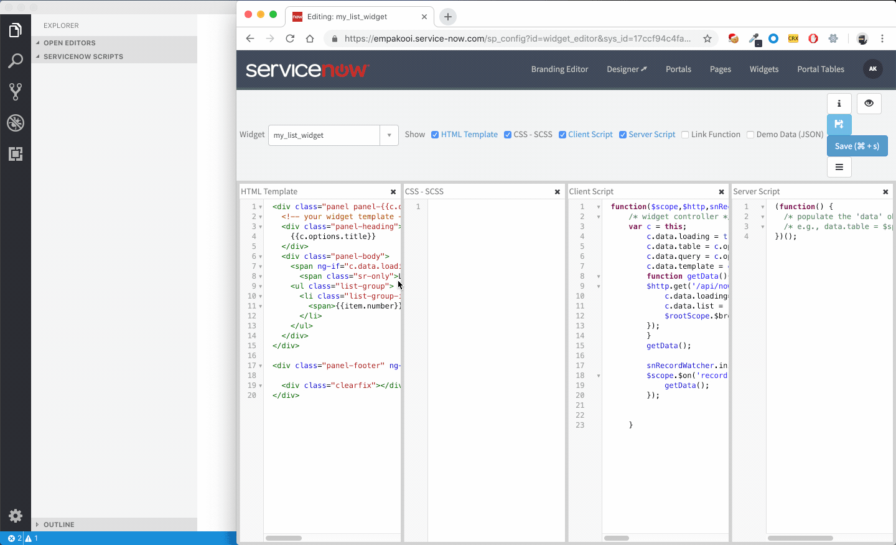
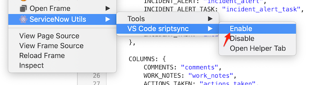
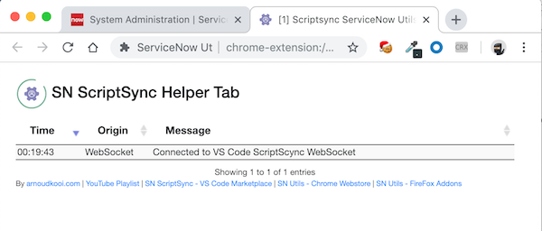
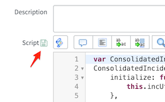
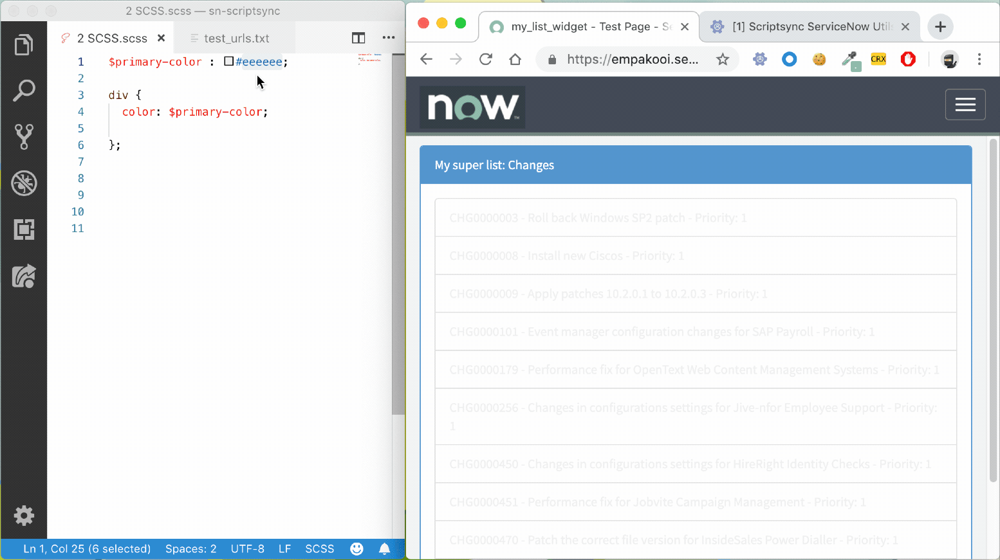
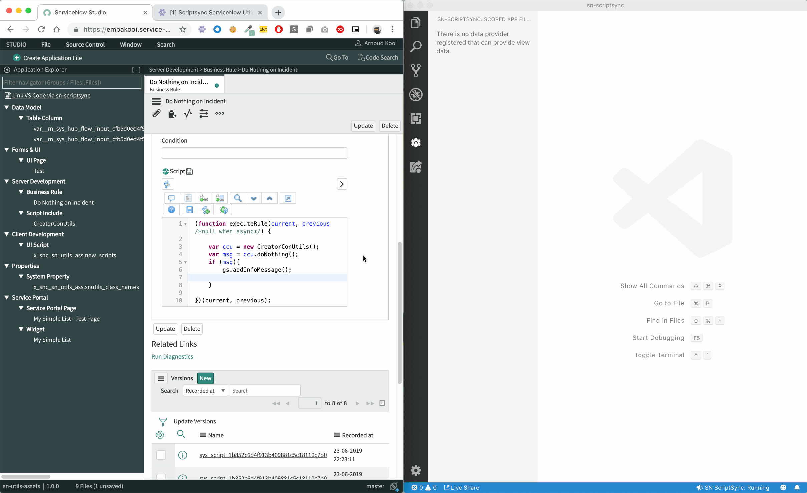
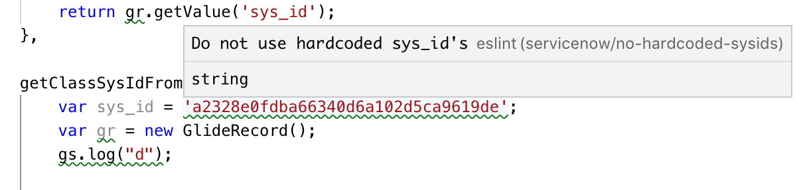

# sn-scriptsync sync with ServiceNow
Easy integration from ServiceNow to VS Code, enabling you to script in a full-fledged editor without any configuration. Now with full AI agent support!



## What's New in 4.0 - AI Agent Support 🤖

Version 4.0 is a major release bringing **native AI coding assistant support** and powerful automation capabilities to sn-scriptsync.

> **📝 AI Assistant Setup**  
> When you start sn-scriptsync, an `agentinstructions.md` file is automatically copied to your workspace root.  
> **Rename it** based on your AI tool:
> - **Cursor**: `.cursorrules`
> - **Claude**: `CLAUDE.md`  
> - **GitHub Copilot**: `.github/copilot-instructions.md`  
> - **Windsurf**: `.windsurfrules`  
>
> This file contains comprehensive guidelines for AI agents to work effectively with sn-scriptsync, including file structure patterns, Agent API documentation, and ServiceNow best practices. **You can expand this file** with your own project-specific instructions, coding standards, or ServiceNow patterns to further educate your AI assistant.
>
> 📚 **Learn more**: See [`agentrules/agentinstructions.md`](https://github.com/arnoudkooi/sn-scriptsync/blob/main/agentrules/agentinstructions.md) for the template and [`agentrules/info.md`](https://github.com/arnoudkooi/sn-scriptsync/blob/main/agentrules/info.md) for detailed setup instructions.
>
> 💬 **Feedback Welcome**: This is a new feature! Please share your experience and suggestions via [GitHub Issue or Discussion](https://github.com/arnoudkooi/sn-scriptsync/).
>
> ⚠️ **Disclaimer**: AI coding assistants are powerful tools but can make mistakes. Since changes are automatically synced to ServiceNow, it's recommended to work in your PDI or development instances and review changes thoroughly. This tool is provided as-is without warranty - use at your own discretion, especially in production environments.
>
> **Requirements**: The Agent API features require **SN Utils 9.2.0.0 or higher** in your browser. 

### 🤖 AI Agent & External Change Support

Files modified by AI agents (Cursor, GitHub Copilot, Windsurf, etc.), git operations, or external editors are now **automatically synced** to ServiceNow:

- **Automatic detection**: External file changes are monitored via file system watcher
- **Smart batching**: Changes are intelligently grouped and deduplicated for efficiency
- **Multi-field batching**: Multiple field changes on the same record are combined into a single API call
- **New `syncDelay` setting**: Control sync frequency (default: 30 seconds, set to 0 to disable)
- **Pending Saves Queue**: New tree view showing files waiting to sync
  - Pause/Resume queue functionality
  - "Sync Now" button for immediate sync
  - Remove individual files from queue
- **New artifact creation**: AI agents can create new Script Includes and other artifacts by simply creating files in the correct folder structure

### ⚡ File-based Agent API

AI agents can now interact with scriptsync programmatically via an **event-driven folder queue**. The file-based approach was designed to be **simple and dependency-free** - no npm packages, no HTTP servers, just JSON files that any AI agent can read and write.

**Event-Driven Queue (Recommended):**
- New `agent/requests/` and `agent/responses/` folder structure
- Instant, event-driven processing (no polling on extension side)
- Parallel request support with unique file names (`req_<id>.json`, `res_<id>.json`)
- Zero-latency responses for local commands (<100ms)

**Available Commands:**
- `check_connection` - Verify server and browser connection
- `get_sync_status` - Get current sync queue status
- `sync_now` - Immediately sync all pending files
- `query_records` - Query any ServiceNow table with encoded queries
- `create_artifact` - Create new records directly (Script Includes, Business Rules, etc.)
- `update_record` / `update_record_batch` - Update existing records
- `open_in_browser` - Open artifacts in ServiceNow
- `take_screenshot` - Capture ServiceNow pages
- `upload_attachment` - Attach files to records
- `switch_context` - Switch update sets, application scope, or domain
- And many more...

See [CHANGELOG.md](https://github.com/arnoudkooi/sn-scriptsync/blob/main/CHANGELOG.md) for complete Agent API documentation.

### 🔒 Security Enhancements

Comprehensive security measures protect your workspace and ServiceNow instance:

- **Request ID validation**: Alphanumeric with underscores/hyphens only (`^[a-zA-Z0-9_-]+$`)
- **Workspace boundary enforcement**: All file operations restricted to VS Code workspace
- **Path traversal protection**: File paths normalized and validated to prevent directory escapes
- **Upload security**: File path validation for attachment uploads
- **Agent folder isolation**: `agent/` folders excluded from ServiceNow sync and git tracking

### 🎨 Context Menu Improvements

Reduce clutter with smart context menu management:

- **New `showContextMenu` setting**: Hide/show sn-scriptsync commands in the context menu
- **Language-specific overrides**: Configure per file type (e.g., hide for markdown)
- **Server-aware visibility**: Context menu only appears when scriptsync server is running
- **Smart filtering**: Commands hidden for internal files, JavaScript-only commands properly scoped

Example configuration:
```json
{
    "sn-scriptsync.showContextMenu": true,
    "[markdown]": {
        "sn-scriptsync.showContextMenu": false
    }
}
```

### File Structure
Files are stored in a clean, organized structure:

```
instancename/scopename/tablename/recordname.field.extension
```

Example: `myinstance/global/sys_script_include/MyUtils.script.js`

Tables like `sp_widget` get their own folder:
```
instancename/scopename/sp_widget/WidgetName/client_script.js
```

### YouTube Demo
📺 [Quick 3.0 demo (August 2023)](https://www.youtube.com/watch?v=cpyasfe93kQ)

# SN Utils
Requires the latest version of SN Utils, links via: 
[arnoudkooi.com](https://arnoudkooi.com)  

**In case of issues, always check for the latest version of both the browser and VS Code extension, and update if needed!**

# Setup
After installing both this extension and the browser extension, open a folder in VS Code and enable scriptsync in VS Code.

## Setting folder
In the settings page you can enter a default file path.
When this folder is opened as workspace, the service is automatically started.
Default value for path: ~/Documents/sn-scriptsync


## Manual start/stop
The ScriptSync service can be manually started or stopped by clicking the Statusbar text in the bottom of the window.


## Enable in SN Utils
From the browser ScriptSync must be enabled once, by opening the popup and in the settings tab enable the checkbox 


# Usage
While using, be sure to keep the helper tab open. This will show logging and acts as a communication channel between ServiceNow and VS Code. This will be automaticly opened when clicking a scriptsync button in your instance.


## Forms
After activating, in forms for appropriate fields, such as script, css and html a small save button will display.

Clicking it will save the current field value direct to the filesystem and open it in VS Code.


In VS Code the structure for the file will be:
instance/table/fieldname^scriptname^sys_id.extension

Saving it in VS Code, will save it back to the instance.

## Widgets
The workflow for ServicePortal widgets is shown in the animated gif above. From the widget editor click on the save button.
This will create all the relevant fields as files on the filesystem, in a folder with the name of the widget.
In a subfolder the angular ng-templates will be placed.

Besides that a file test_urls.txt is created.
In this page you can add your own urls. When saving a file, ScriptSync will refresh the browser pages that match that URL, enabling live preview.

Widget SCSS can be live edited, each change can immediate be previewed in the browser. See animation below.



## Studio integration
In studio you can click Link VS Code via sn-scriptsync.
It will show you the tree of artefacts in your app and all the scriptable fields.
When clicking an field, it will be pulled from the server. If the file is already open, it will switch to that window.
This is an alterbative to clicking each individual button in the platform. SP widgets are not jet supported at this point.
Note this feature is in beta.



## AI Agent Support

sn-scriptsync is designed to work seamlessly with AI coding assistants. Changes made by AI tools are automatically detected and synced to your ServiceNow instance.

### Supported AI Tools
- **Cursor** (with Claude, GPT-4, etc.)
- **GitHub Copilot**
- **Windsurf**
- **Cline / Claude Dev**
- **Aider**
- Any tool that modifies files on disk

### How It Works
1. **Automatic detection**: File changes are detected via file system watcher
2. **Debounced sync**: Changes are batched and synced after a configurable delay (default: 30 seconds)
3. **Queue management**: View pending syncs in the "Pending Saves" panel, pause/resume, or sync immediately
4. **Multi-field batching**: Multiple changes to the same record are combined into one API call

### Settings
- `syncDelay`: Seconds to wait before syncing external changes (default: 30, set to 0 to disable)
- Manual saves (Ctrl+S) always sync immediately, bypassing the queue

### Creating New Artifacts with AI
AI agents can create new ServiceNow artifacts by simply creating files in the correct location:

```
{instance}/{scope}/{table}/{name}.{field}.{extension}
```

**Example - Create a new Script Include:**
```
myinstance/global/sys_script_include/MyNewUtils.script.js
```

The extension will automatically:
1. Detect the new file
2. Create the record in ServiceNow
3. Update `_map.json` with the new sys_id

### AI Agent Instructions (for AI tools)

Add these instructions to your AI tool's system prompt or rules file for optimal ServiceNow development:

```markdown
## ServiceNow Development with sn-scriptsync

When working with ServiceNow files synced via sn-scriptsync:

### File Structure
- Files are stored as: `{instance}/{scope}/{table}/{name}.{field}.{extension}`
- Example: `myinstance/global/sys_script_include/MyUtils.script.js`
- Internal files starting with `_` (like `_map.json`, `_settings.json`) should NOT be edited

### Creating New Artifacts
1. Create the file in the correct folder structure
2. Use the correct field name in the filename:
   - Script Includes: `{name}.script.js`
   - Business Rules: `{name}.script.js`
   - Client Scripts: `{name}.script.js`
   - UI Scripts: `{name}.script.js`
   - Widgets: folder with `client_script.js`, `script.js`, `template.html`, `css.scss`

### Best Practices
- Always check `_map.json` to see existing artifacts and their sys_ids
- Do NOT manually create scope folders - sync at least one artifact first
- The scope must exist in ServiceNow before creating artifacts in it
- Use the existing coding style found in the synced files

### Available Tables
Common tables: `sys_script_include`, `sys_script` (Business Rules), `sys_ui_script`, 
`sys_script_client`, `sp_widget`, `sys_ui_page`, `sys_ui_action`, `sys_ws_operation`
```

### File-based Agent API

For advanced AI integrations, scriptsync exposes a file-based API. AI agents can write requests to `_requests.json` and read responses from `_responses.json` in the instance folder.

**Example - Check connection:**
```json
{"id": "1", "command": "check_connection"}
```

**Available commands:** `check_connection`, `get_sync_status`, `sync_now`, `query_records`, `create_artifact`, `update_record`, and more. See [CHANGELOG.md](https://github.com/arnoudkooi/sn-scriptsync/blob/main/CHANGELOG.md) for full documentation.

## Context Menu Visibility
The sn-scriptsync context menu commands only appear when the scriptsync server is running. You can also hide them completely using the `showContextMenu` setting.

This setting supports **language-specific overrides**, allowing you to show/hide commands per file type:

```json
{
    "sn-scriptsync.showContextMenu": true,
    "[markdown]": {
        "sn-scriptsync.showContextMenu": false
    },
    "[plaintext]": {
        "sn-scriptsync.showContextMenu": false
    }
}
```

You can also disable it globally and enable only in specific workspaces by adding workspace-specific settings.

## Intellisense
Basic inteliisense is added to autocomplete the ServiceNow API's and functions.

## ESLint
I recommend installing ESLint and the [ESLint ServiceNow plugin](https://www.npmjs.com/package/eslint-plugin-servicenow).
This will do some basic code checks.



## FAQs

I'm using `<script>` tags in a widget HTML template, and they do not sync to my instance properly. How can I resolve this?

**Solution** (See [#24](https://github.com/arnoudkooi/sn-scriptsync/issues/24)): In your ServiceNow instance, set the following system property:
* **`glide.rest.sanitize_request_input`** = **`false`** 
(This may also apply to UI Macro's and other places where tags get escaped)

I get an error when using in Safari: "User Not Authenticated"

**Solution** Disable "User Not Authenticated" in Safari Privacy settings

sn-scriptsync does not work in Brave browser

**Solution** Shield down your instance in Brave browser


## Issues
Please report an issue on GitHub if you experience problems, or have a feature request.

## License & Warranty

This tool comes as is with no warranty. Not allowed to copy or republish this extension or its code.

> **📋 Licensing Update Coming Soon**  
> sn-scriptsync will receive an updated license with the upcoming SN Utils Store App release, covering enterprise usage, redistribution, and commercial integration.  
> Questions? Contact: arnoud@snutils.com


